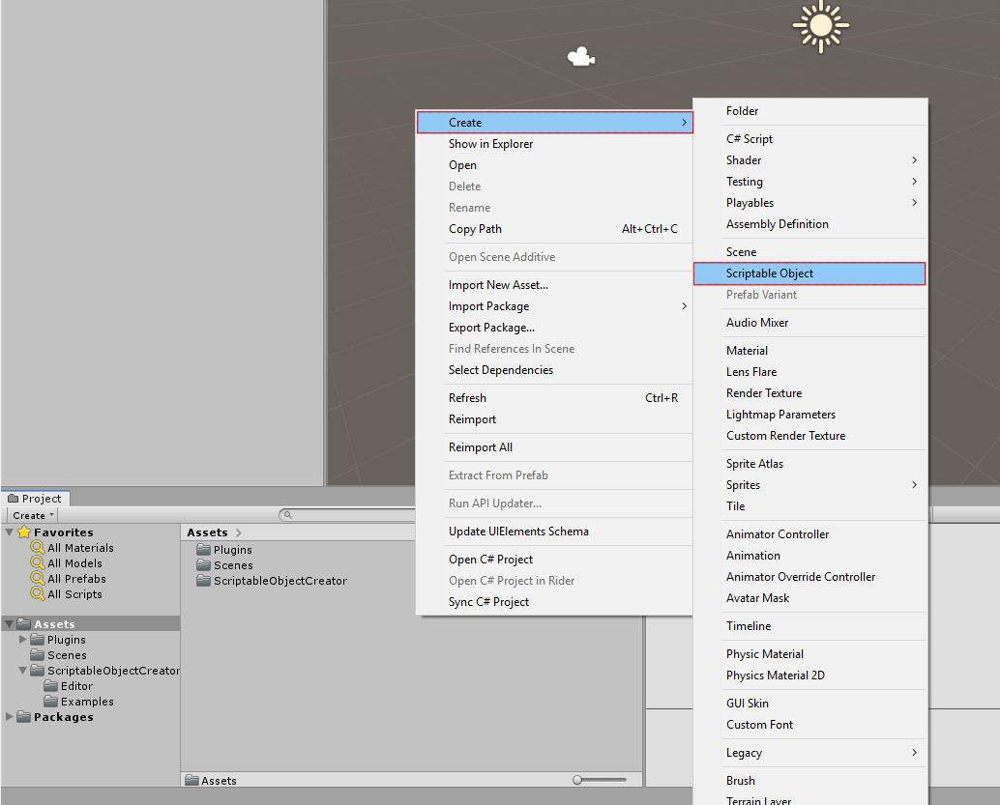
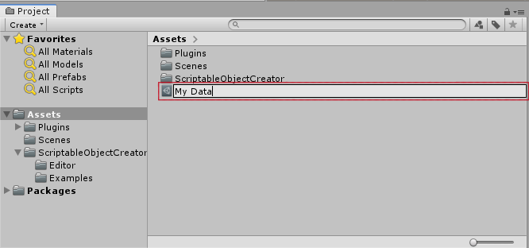
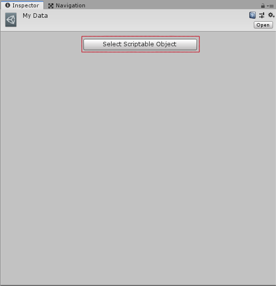
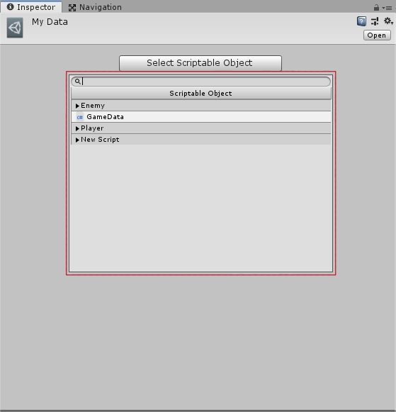
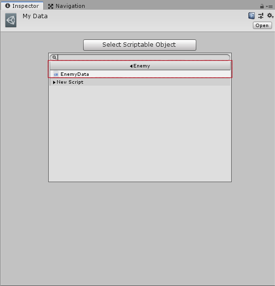
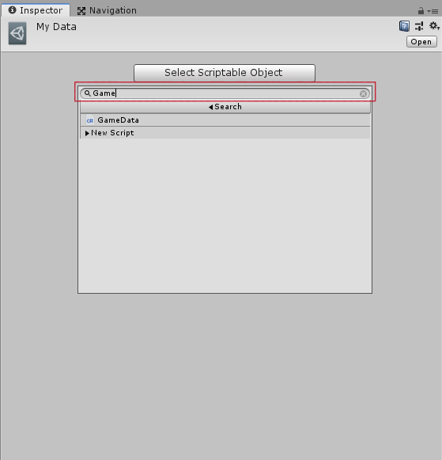
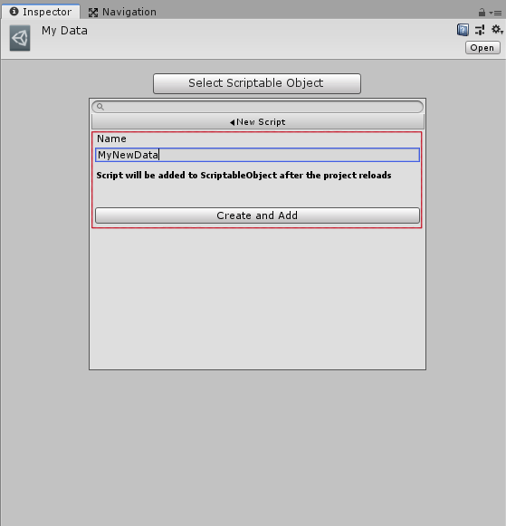
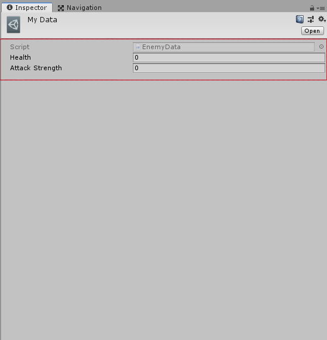

# ScriptableObjectCreator
Create a ScriptableObject in Unity as easily as using "Add Component".

Start by creating a new blank ScriptableObject

Then name the new object 

Then, in the Inspector, you can search for a ScriptableObject to select

Navigate through the hierarchy to find the ScriptableObject you want

Or search for the name

You can even create a new file in the interface

And in the end, your new ScriptableObject will be complete

